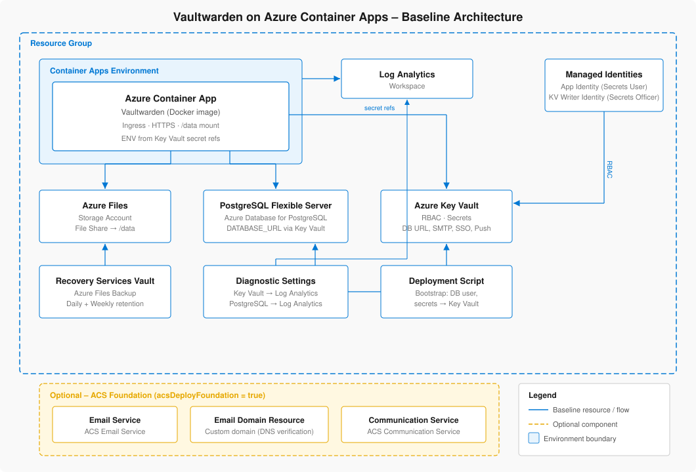

# Vaultwarden auf Azure Container Apps (ACA)

Production-orientiertes ARM-Template für **Vaultwarden auf Azure Container Apps** mit:
- **Azure Files** für `/data`
- **Azure Database for PostgreSQL Flexible Server** für die relationale Datenhaltung
- **Azure Key Vault** für Secrets
- **Deployment Script** für Bootstrap-Aufgaben (DB-App-User, `DATABASE_URL`, SMTP-/SSO-/Push-Secrets; bei Push = Installation ID + Key) mit optionalem `deploymentScriptForceUpdateTag` für einen gezielten Re-Run
- optionaler **ACS Foundation Deploy** (Email Service, Email Domain Resource, Communication Service)

## Deploy

Es gibt bewusst **nur einen** Deploy-to-Azure-Pfad. Alles, was sauber vollautomatisierbar ist, steckt in `main.json`.

Wenn du das Repo wie zuvor wieder unter **demselben GitHub-Pfad** betreibst, funktioniert der Button direkt weiter.
Wenn du Owner, Repo-Name oder Branch änderst, muss nur diese Raw-URL im Button angepasst werden.

Für eine rein lokale ZIP ohne GitHub-Hosting bleibt alternativ der Portal-Weg **Deploy a custom template** / **Build your own template in the editor** möglich.

**Bewusst manuell nachgelagert bleiben weiterhin:**
- ACA Custom Domain + Zertifikat
- ACS DNS-Verifikation der E-Mail-Domain
- ACS Domain Linking auf die Communication Service Resource
- ACS SMTP Username + finale SMTP-Aktivierung

Der Grund ist in beiden Fällen derselbe: DNS-/Verifikations-Schritte erzeugen ein Henne/Ei-Thema und der manuelle Aufwand ist gering. Deshalb bleibt der Core-Deploy schlank und reproduzierbar, während Domain-/Mail-Aktivierung als dokumentierte Post-Deploy-Schritte im Portal/Runbook erfolgen.

---

## Architektur-Überblick

Detaillierte Beschreibung der Ressourcen, Datenflüsse und Designentscheidungen: [docs/architecture.md](./docs/architecture.md)

---

## Dokumentation

- [Architektur-Dokumentation](./docs/architecture.md)
- [Vaultwarden – How to Use (BSSE)](./docs/HowToUse/HowToUse.pdf)
- [Operations Playbook / Runbook](./docs/HowToInstall/Operation-Playbook.md)

---

## Beispiel-Parameterdateien

Unter `./examples/parameters/` liegen bewusst **einsatznahe Vorlagen** statt einer einzigen Riesen-Datei mit allen Parametern:

- **`main.parameters.m365-smtp-auth.example.json`**  
  M365-/Office-365-naher Standardpfad mit SMTP Auth (`smtp.office365.com`, Port 587, `starttls`).

- **`main.parameters.m365-smtp-auth-sso.example.json`**  
  M365 SMTP Auth plus vorbereitete Entra-ID-/OIDC-Parameter für SSO.

- **`main.parameters.m365-direct-send.example.json`**  
  Beispiel für Direct Send ohne SMTP-Auth. Nur für bewusst passende interne Szenarien gedacht.

- **`main.parameters.m365-smtp-auth-sso-push.example.json`**  
  M365 SMTP Auth plus Entra-ID-/OIDC-SSO und Bitwarden-Push-Parameter.

- **`main.parameters.acs-foundation-m365-dns-hosted.example.json`**  
  Beispiel für ACS-Foundation-Deploy für eine kundeneigene Domäne mit in Microsoft 365 gehosteter DNS-Zone. Der Repo-Standardpfad bleibt trotzdem der öffentlich dokumentierte ACS-Modus `CustomerManaged`.

Alle Dateien enthalten **nur Platzhalterwerte** und sollen kopiert bzw. tenant-/kundenspezifisch angepasst werden. Insbesondere Secrets, Tenant-IDs, App-IDs, Domains und Absenderadressen müssen vor einem produktiven Deploy ersetzt werden.

---

## Repo-Struktur

- **`main.json`** → Core Deployment für Vaultwarden, PostgreSQL, Azure Files, Key Vault, ACA und optional ACS Foundation
- **`docs/HowToInstall/Operation-Playbook.md`** → Go-Live, Betrieb, ACS, Backup/Recovery, Smoke-Tests

Es gibt **kein lokales PowerShell-Wrapper-Skript** mehr. Das Repo ist bewusst auf **ARM/Portal/Deploy-to-Azure** ausgerichtet.

---

## Was `main.json` deployt

### Immer enthalten
- Azure Container Apps Environment + Log Analytics
- Azure Container App für Vaultwarden
- Azure Storage Account + Azure Files Share (`/data`)
- Azure Database for PostgreSQL Flexible Server + Datenbank
- User Assigned Managed Identity
- Azure Key Vault (RBAC)
- Deployment Script für:
  - `ADMIN_TOKEN`
  - DB-App-User + `DATABASE_URL`
  - SMTP-Secret (bei SMTP Auth)
  - SSO-Secret (optional)
  - Push-Secrets (optional; Installation ID + Key)
  - MX-Lookup für Direct Send (wenn `smtpUseAuth=false`)
  - kontrollierbaren Re-Run über `deploymentScriptForceUpdateTag`
- Azure Files Backup (standardmäßig aktiv)

Das Bootstrap-Script hängt jetzt explizit auch von der optionalen PostgreSQL-Firewallregel `AllowAzure` ab, wenn `allowAzureServicesToPostgres=true` gesetzt ist. Zusätzlich wurden die internen Warte-/Retry-Fenster auf 10 Minuten erweitert, damit RBAC- und Firewall-Propagation weniger leicht in einen Timing-Fehler laufen.

### Optional: ACS Foundation
Wenn `acsDeployFoundation = true`, deployt `main.json` zusätzlich:
- **Azure Communication Services Email Service**
- **ACS Email Domain Resource**
- **ACS Communication Service**

Damit ist die Grundinfrastruktur bereits vorhanden. **Nicht** automatisiert werden aber weiterhin die DNS-Verifikation, das Domain Linking und der SMTP Username.

### Bewusst **nicht** final automatisiert
- ACA Custom Domain / Zertifikatsbindung
- ACS Domain-Verifikation
- ACS `linkedDomains`
- ACS `smtpUsernames`
- ACS-RBAC für die SMTP-Entra-App

Diese Schritte bleiben bewusst **manuell nachgelagert**. So bleibt der Core-Deploy bei einem Button, während DNS-/Verifikationsschritte wie bei der ACA-Custom-Domain im Portal bzw. nach Runbook durchgeführt werden.

---

## SMTP-Modi

## A) SMTP Auth (**Produktiv-Default**)
Empfohlener Standard.

- `smtpUseAuth = true` (Default)
- leerer `smtpHost` → `smtp.office365.com`
- `smtpPort = 587`
- `smtpSecurity = starttls`
- `smtpUsername` + `smtpPassword` erforderlich
- optional `smtpAuthMechanism` (z. B. `Login`, `Plain`, `Xoauth2`)

### Geeignet für
- Microsoft 365 SMTP Submission
- eigenen SMTP Relay / Mailgateway
- ACS SMTP **nach** ACS-Finalisierung

---

## B) Direct Send
Nur für klar begrenzte interne Szenarien sinnvoll.

- `smtpUseAuth = false`
- `smtpHost` leer → MX-Lookup ausschließlich über `mailRootDomain`
- aktueller Template-Pfad setzt für Vaultwarden in diesem Modus **`SMTP_PORT=25`** und **`SMTP_SECURITY=starttls`**
- **`SMTP_USERNAME` darf nicht gesetzt sein**
- **`SMTP_PASSWORD` darf nicht gesetzt sein**
- **`SMTP_AUTH_MECHANISM` darf nicht gesetzt sein**

### Vaultwarden-spezifisch wichtig
Vaultwarden behandelt SMTP-Auth nicht nur inhaltlich, sondern auch anhand der tatsächlich vorhandenen Settings. In der offiziellen `.env.template` steht explizit: Wenn `SMTP_USERNAME` gesetzt ist, ist `SMTP_PASSWORD` verpflichtend; `SMTP_AUTH_MECHANISM`, `HELO_NAME`, `SMTP_EMBED_IMAGES`, `SMTP_DEBUG`, `SMTP_ACCEPT_INVALID_CERTS` und `SMTP_ACCEPT_INVALID_HOSTNAMES` sind optionale Zusatzeinstellungen. Für Direct Send ist deshalb nicht nur "leer" relevant, sondern vor allem: **keine Auth-ENV an die App durchreichen**. Das Template macht das bereits, wenn `smtpUseAuth=false`.

### Admin-UI-/`config.json`-Override beachten
Vaultwarden speichert Admin-UI-Änderungen persistent in `/data/config.json`. In Diagnoseausgaben ist sichtbar, dass dabei u. a. `SMTP_HOST`, `SMTP_SECURITY`, `SMTP_PORT`, `SMTP_FROM`, `SMTP_FROM_NAME`, `SMTP_USERNAME` und `SMTP_PASSWORD` als von `config.json` übersteuert auftauchen können. Wenn du also **von SMTP Auth auf Direct Send wechselst**, reicht es nicht immer, dass das Template die Auth-ENV weglässt: bereits gespeicherte SMTP-Auth-Werte im Vaultwarden-Adminbereich müssen dann ebenfalls bereinigt werden.

### Geeignet für
- internen Versand in klar kontrollierten Microsoft-365-Szenarien

### Betriebsnotiz
Wenn `smtpHost` leer bleibt, muss `mailRootDomain` gesetzt sein, damit das Bootstrap-Script den MX-Eintrag genau dieser Domain auflösen kann. Das Script installiert dafür keine OS-Pakete nach und lädt auch keine Python-Pakete zur Laufzeit. Falls die Runtime weder `dig` noch `nslookup` enthält, setze `smtpHost` bei Direct Send explizit.

### Nicht als allgemeiner Produktiv-Default gedacht
Wenn Mail für den Betrieb Pflicht ist, ist SMTP Auth oder ACS SMTP in der Regel robuster und planbarer.

---

## C) ACS SMTP
ACS kann jetzt **teilweise** schon über `main.json` vorbereitet werden.

### Schritt 1 – Foundation mit `main.json`
Setze beim Deploy:
- `acsDeployFoundation = true`
- `acsDataLocation` passend zur gewünschten Geography
- `acsDomainName` optional explizit, sonst wird `mailRootDomain` verwendet
- kein `acsDomainManagement` mehr: das Repo nutzt bewusst nur noch den öffentlich dokumentierten ACS-Custom-Domain-Pfad `CustomerManaged`

Damit baut `main.json` bereits:
- Email Service
- Email Domain Resource
- Communication Service

### Schritt 2 – manuelle ACS-Finalisierung
Die vollständigen manuellen Betriebs-Schritte stehen im [Operations Playbook / Runbook](./docs/HowToInstall/Operation-Playbook.md) im Abschnitt **„ACS Foundation + ACS SMTP“**. Kurzfassung:
1. DNS-Einträge der ACS-Domain im maßgeblichen DNS-System setzen (auch bei Microsoft-365-gehosteter Zone also im M365 Admin Center)
2. warten, bis **Domain Status**, **SPF**, **DKIM** und **DKIM2** vollständig verified sind
3. die verifizierte Domain mit dem Communication Service verknüpfen
4. der verwendeten Entra-Anwendung die Rolle **Communication and Email Service Owner** auf der Communication-Resource zuweisen
5. SMTP-Username für diese Entra-Anwendung anlegen und Status **Ready to use** abwarten
6. `main.json` erneut mit diesen Werten deployen:
   - `smtpUseAuth = true`
   - `smtpHost = smtp.azurecomm.net`
   - `smtpPort = 587`
   - `smtpSecurity = starttls`
   - `smtpUsername = <ACS SMTP Username>`
   - `smtpPassword = <Client Secret der Entra App>`
   - optional `smtpAuthMechanism = Xoauth2`, falls dein gewählter ACS-/Providerpfad das verlangt

So bleibt der produktive Hauptpfad bei **einem** Deploy-to-Azure-Button, und ACS wird wie die ACA-Domain sauber nachgezogen.

---

## Vaultwarden-spezifische Mail-Eigenheiten

1. **Mail-Service aktivieren**  
   Laut offizieller `.env.template` wird der Mail-Service aktiv, wenn `SMTP_FROM` und entweder `SMTP_HOST` oder `USE_SENDMAIL` gesetzt sind. `DOMAIN` soll korrekt gesetzt sein, damit Links in E-Mails auf den richtigen Host zeigen. Das Template erfüllt das grundsätzlich, aber für Produktion sollte `smtpFrom` bewusst statt nur implizit gesetzt werden.

2. **Direct Send: Auth-Variablen wirklich weglassen**  
   Für Direct Send sollen `SMTP_USERNAME`, `SMTP_PASSWORD` und `SMTP_AUTH_MECHANISM` in der App-Konfiguration nicht vorhanden sein. Das Template erzeugt diese drei ENV nur bei `smtpUseAuth=true`.

3. **Admin-UI kann Template-Werte überlagern**  
   Vaultwarden speichert Änderungen aus dem Adminbereich in `/data/config.json`. Wenn dort SMTP-Werte oder ein `admin_token` persistiert sind, können sie die per ENV gedachten Werte überlagern. Bei einem Moduswechsel oder beim Abschalten des Admin-Panels daher immer den Vaultwarden-Adminbereich bzw. die Diagnoseansicht mitprüfen.

4. **Admin-Panel-Lifecycle bewusst zweistufig fahren**  
   Das Repo ist absichtlich auf folgenden Weg ausgelegt: Erstdeployment mit `adminPanelEnabled=true` fuer Bootstrap, Tests und Admin-Diagnose; danach erneuter Deploy mit `adminPanelEnabled=false`, damit `ADMIN_TOKEN` nicht mehr an die App durchgereicht wird. Wichtig: Falls im Adminbereich bereits gespeichert wurde und dadurch `admin_token` in `/data/config.json` steht, muss dieser persistierte Wert ebenfalls entfernt werden, sonst bleibt das Admin-Panel trotz entfernter ENV aktiv.

5. **Optionale SMTP-Feinparameter**  
   `SMTP_AUTH_MECHANISM`, `HELO_NAME`, `SMTP_EMBED_IMAGES`, `SMTP_DEBUG`, `SMTP_ACCEPT_INVALID_CERTS` und `SMTP_ACCEPT_INVALID_HOSTNAMES` sind echte Vaultwarden-Parameter. Das Repo reicht davon aktuell nur `SMTP_AUTH_MECHANISM` durch. Das ist für den Standardpfad okay; die übrigen Optionen sind bewusst nicht automatisiert und gehören in Troubleshooting-/Sonderfälle.

---

## Wichtige Parameter in `main.json`

Die Parameter sind bewusst in zwei Blickrichtungen zu lesen:
- **Azure-/Deploy-Parameter** = steuern Ressourcen, Sizing, Bootstrap und Azure-seitige Hilfsdienste
- **Vaultwarden-Parameter** = werden ganz oder teilweise zu Vaultwarden-ENV-Werten bzw. steuern Vaultwarden-nahes Verhalten

### Azure-/Deploy-Parameter

#### Core / Deploy
- `location`
- `environment`
- `bsseRef`
- `appName`
- `deploymentScriptForceUpdateTag` (nur bewusst ändern, wenn das Bootstrap-Script sicher erneut laufen soll)
- `diagnosticsEnabled`
- `allowInsecureHttp`
- `vaultwardenImage`
- `cpuCores`
- `memorySize`

#### Azure Files / Backup
- `storageAccountSku`
- `azureFilesBackupEnabled`
- `azureFilesBackupScheduleRunTime`
- `azureFilesBackupTimeZone`
- `azureFilesBackupDailyRetentionDays`
- `azureFilesBackupWeeklyDaysOfWeek`
- `azureFilesBackupWeeklyRetentionWeeks`

#### PostgreSQL / Bootstrap-only
- `postgresSkuName`
- `postgresStorageGB`
- `postgresBackupRetentionDays`
- `allowAzureServicesToPostgres`
- `dbAdminUser`
- `dbPassword`

`dbAdminUser` und `dbPassword` bleiben **bewusst** im Template, weil sie für die Erstellung des PostgreSQL Flexible Servers und fuer das initiale Bootstrap-Script benötigt werden. Sie sind **keine** produktiven Vaultwarden-App-Credentials; die App verwendet danach den separaten App-User via `DATABASE_URL` aus Key Vault.

#### ACS Foundation
- `acsDeployFoundation`
- `acsDataLocation`
- `acsDomainName`

Das Repo unterstützt hier absichtlich nur noch den **öffentlich dokumentierten** ACS-Custom-Domain-Pfad. `CustomerManagedInExchangeOnline` wurde deshalb entfernt.

### Vaultwarden-nahe Parameter / ENV-Mapping

#### Basis / Instanzverhalten
- `domainUrl` → `DOMAIN`
- `adminPanelEnabled` → steuert, ob `ADMIN_TOKEN` an die App durchgereicht wird

#### Organisation / Signup / Policies
- `invitationOrgName` → `INVITATION_ORG_NAME`
- `signupsDomainsWhitelist` → `SIGNUPS_DOMAINS_WHITELIST`
- `orgCreationUsers` → `ORG_CREATION_USERS`

Wichtig: `SIGNUPS_DOMAINS_WHITELIST` ist eine echte Vaultwarden-Speziallogik. Wenn du ihn setzt, solltest du den Self-Service-Signup-Prozess bewusst testen; Domain-Whitelist und Einladungs-/Org-Prozesse greifen dann anders als bei einer komplett offenen Registrierung.

#### Mail / SMTP
- `mailRootDomain`
- `smtpUseAuth`
- `smtpFrom` → `SMTP_FROM`
- `smtpFromName` → `SMTP_FROM_NAME`
- `heloName` → `HELO_NAME` (leer = Host aus `DOMAIN`)
- `smtpHost` → `SMTP_HOST`
- `smtpPort` → `SMTP_PORT`
- `smtpSecurity` → `SMTP_SECURITY`
- `smtpUsername` → `SMTP_USERNAME`
- `smtpPassword` → `SMTP_PASSWORD`
- `smtpAuthMechanism` → `SMTP_AUTH_MECHANISM`

#### SSO / OIDC
- `ssoEnabled` → `SSO_ENABLED`
- `ssoOnly` → `SSO_ONLY`
- `ssoAuthority` → `SSO_AUTHORITY`
- `ssoClientId` → `SSO_CLIENT_ID`
- `ssoClientSecret` → `SSO_CLIENT_SECRET`
- `ssoScopes` → `SSO_SCOPES`

#### Mobile Push
- `pushEnabled` → `PUSH_ENABLED`
- `pushInstallationId` → `PUSH_INSTALLATION_ID`
- `pushInstallationKey` → `PUSH_INSTALLATION_KEY`
- `pushUseEuServers` → steuert `PUSH_RELAY_URI` / `PUSH_IDENTITY_URI` für `.com` vs `.eu`

`pushInstallationId` und `pushInstallationKey` werden jetzt beide als Secrets behandelt und in Key Vault abgelegt.

### Weiterführende Dokumentation für Sonderfälle
- Playbook / Runbook: [docs/HowToInstall/Operation-Playbook.md](./docs/HowToInstall/Operation-Playbook.md)
- Bitwarden Installation ID / Key: https://bitwarden.com/host/
- Bitwarden Hosting-FAQ: https://bitwarden.com/help/hosting-faqs/
- Bitwarden Push Relay: https://bitwarden.com/help/configure-push-relay/
- Vaultwarden SSO (Wiki): https://github.com/dani-garcia/vaultwarden/wiki/Enabling-SSO-support-using-OpenId-Connect

## Outputs

Wenn `acsDeployFoundation = true`, gibt das Deployment zusätzlich aus:
- `acsFoundationEnabled`
- `acsEmailServiceName`
- `acsCommunicationServiceName`
- `acsEmailDomain`
- `acsEmailDomainResourceId`
- `acsNextSteps`

Diese Outputs dienen als operative Brücke zwischen Core-Deploy und manueller ACS-Finalisierung.

---

## Redeploy- und Secret-Verhalten

### Gleiches Template erneut in dieselbe Resource Group deployen
- ARM arbeitet hier im Regelfall **incremental**
- bestehende PostgreSQL-/Azure-Files-/Vaultwarden-Daten bleiben erhalten
- das Bootstrap-`deploymentScript` läuft **nicht automatisch erneut**, wenn sich an seiner Resource nichts geändert hat
- für einen gezielten Re-Run dient `deploymentScriptForceUpdateTag`

### Wann `deploymentScriptForceUpdateTag` sinnvoll ist
Nutze den Parameter nur bewusst, zum Beispiel wenn:
- DB-App-User / `DATABASE_URL` erneut reconciled werden sollen
- SMTP-/SSO-/Push-Secrets (bei Push = Installation ID + Key) trotz sonst identischer Template-Werte erneut geschrieben werden sollen
- ein No-Op-Redeploy nicht reicht, weil das Bootstrap-Script sicher nochmals laufen soll

### Key-Vault-Secrets in ACA
Die Container App verwendet versionlose Key-Vault-Secret-URIs. Neue Secret-Versionen können dadurch nachträglich übernommen werden, ohne dass die Secret-URI im Template geändert werden muss.

Für **planbare Sofortwirkung** ist trotzdem weiterhin sinnvoll:
- gezielter Redeploy mit inhaltlicher Änderung
- oder bewusster Restart / neue Revision nach sensiblen Secret-Änderungen

### Admin-Panel nach dem Erstdeployment deaktivieren
Empfohlener Betriebsweg:
1. Erstdeployment mit `adminPanelEnabled = true` (Default)
2. Bootstrap / Tests / Admin-Diagnose durchführen
3. Falls im Vaultwarden-Adminbereich bereits gespeichert wurde: prüfen, dass kein persistierter `admin_token` in `/data/config.json` stehen bleibt
4. `main.json` erneut mit `adminPanelEnabled = false` deployen
5. prüfen, dass das Admin-Panel danach nicht mehr aktiv ist

Für spätere Wartung kann das Admin-Panel gezielt temporär wieder aktiviert werden, indem `adminPanelEnabled` wieder auf `true` gesetzt und danach nach Abschluss der Arbeiten erneut auf `false` zurückgestellt wird.

## Manuelle Schritte vor Go-Live

Diese Schritte sind **bewusst** nicht vollständig automatisiert.

### 1) Custom Domain + TLS für ACA
Wenn du nicht auf der Standard-URL `*.azurecontainerapps.io` bleiben willst:

1. Custom Domain am Container App Ingress hinzufügen
2. DNS Records setzen
3. Zertifikat binden (Managed Certificate oder eigenes Zertifikat)
4. final unter der echten Ziel-URL testen

> `domainUrl` und die reale ACA-Bindung müssen am Ende zusammenpassen.

### 2) ACS Domain DNS / Verifikation / Linking
Wenn du ACS Email nutzt:

1. `acsDeployFoundation = true` mit `main.json` deployen
2. die angezeigten DNS-Records setzen
3. warten bis die Domain **verified** ist
4. die verifizierte Domain mit dem Communication Service verknüpfen
5. SMTP-Username + RBAC für die Entra-App anlegen
6. `main.json` mit den finalen ACS-SMTP-Werten erneut deployen

### 3) Smoke-Tests
Vor Go-Live die Tests aus dem [Operations Playbook](./docs/HowToInstall/Operation-Playbook.md) durchführen.

---

## Was gegenüber dem ursprünglichen Stand bereinigt wurde

- lokales PowerShell-Wrapper-Skript entfernt
- stabilerer Key-Vault-Name
- `enabledForTemplateDeployment` deaktiviert
- Vaultwarden-ENV sauberer modelliert
- `SMTP_AUTH_MECHANISM` wird an Vaultwarden durchgereicht
- optionale ENV-Werte werden nicht mehr pauschal leer gesetzt
- Deployment Script aktualisiert Secrets jetzt bei Änderungen
- SMTP-Auth wird im Deployment Script validiert
- `mailRootDomain` als explizite Mail-Basisdomain eingeführt; keine heuristische Ableitung mehr aus `domainUrl`
- PostgreSQL PITR-Retention parametrierbar gemacht
- ACS von „alles in einem Rutsch“ auf **Foundation automatisch, Finalisierung manuell** umgestellt
- `deploymentScriptForceUpdateTag` für bewusste Bootstrap-Re-Runs ergänzt
- Deployment-Script für PostgreSQL auf `az postgres flexible-server execute` umgestellt; kein `psql`-, `pip`- oder `pg8000`-Pfad mehr nötig

---

## Grenzen / bewusste Designentscheidungen

Dieses Repo deployt bewusst eine **Baseline-Architektur** mit öffentlichem PostgreSQL-Zugriff via Firewall-Regeln und „Allow Azure Services“, weil das für viele kleinere Umgebungen einfacher und günstiger ist.

Wenn du ein stärker gehärtetes Zielbild willst, gehören als nächste Ausbaustufe typischerweise dazu:
- ACA in VNet / Workload Profiles
- Private Access / Private DNS für PostgreSQL
- definierte Egress-IP / NAT
- weitergehendes Alerting / Service Health / Netzwerk-Härtung

Das Core-Template ist damit produktionsnäher als vorher, aber kein vollständiges „Zero-Trust-by-default“-Landing-Zone-Framework.
---

## Quellen / Stand (ACS, M365, Bitwarden/Vaultwarden)

Die verlinkten Aussagen in README und Playbook wurden zuletzt **am 2026-03-20 16:02 CET** gegengeprüft.

### Microsoft Learn / Microsoft 365
- Connect a verified email domain to send email  
  https://learn.microsoft.com/en-us/azure/communication-services/quickstarts/email/connect-email-communication-resource
- Set up SMTP authentication for sending emails  
  https://learn.microsoft.com/azure/communication-services/quickstarts/email/send-email-smtp/smtp-authentication
- Add custom verified email domains  
  https://learn.microsoft.com/en-us/azure/communication-services/quickstarts/email/add-custom-verified-domains
- Troubleshooting domain configuration issues  
  https://learn.microsoft.com/en-gb/azure/communication-services/concepts/email/email-domain-configuration-troubleshooting
- Add DNS records if Microsoft hosts your DNS  
  https://learn.microsoft.com/en-us/office365/admin/setup/add-domain

### Bitwarden / Vaultwarden
- Bitwarden: Request Hosting Installation ID & Key  
  https://bitwarden.com/host/
- Bitwarden Hosting FAQs  
  https://bitwarden.com/help/hosting-faqs/
- Bitwarden Push Relay  
  https://bitwarden.com/help/configure-push-relay/
- Vaultwarden SSO via OpenID Connect (Wiki)  
  https://github.com/dani-garcia/vaultwarden/wiki/Enabling-SSO-support-using-OpenId-Connect
- Vaultwarden Mobile Push (Wiki)  
  https://github.com/dani-garcia/vaultwarden/wiki/Enabling-Mobile-Client-push-notification
